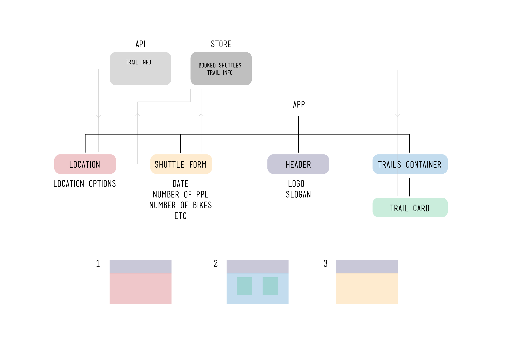

# gravity

Gravity is a React-Redux App allows a user to view mountain bike trails in a targeted area and book a shuttle to take them to the top of that trail.

### Focuses

- Write squeaky clean, well refactored code using ES6 syntax.

- Make informed design decisions to create a user-friendly application.

- Become comfortable with different network requests like GET, POST, & DELETE.

- Solidify concepts with React to create clean and re-useable components.

- Become comfortable with Redux’s lifecycle, creating actions, reducers, and connecting them to React components.

- Understand and solidify concepts with React component, asynchronous code, and Redux testing.

- Get more practice doing network requests with a backend.

### Screenshots
Data Map
- To begin, the overall data flow and necessary components are mapped out.



Design Prototype
- Home Page: Next, a design is implemented and basic user flow is considered.


Homepage
- A user can...


### Tech

- This project was bootstrapped with Create React App utilizing Redux.

- Tested with Jest/Enzyme.

- Links using React Router.

### Team (solo)

- Quinne Farenwald (https://github.com/qfarenwald)

### Set Up

Clone repo.
```
git clone https://github.com/qfarenwald/gravity
```
Install dependencies.
```
npm install
```
Run browser.
```
npm start
```
